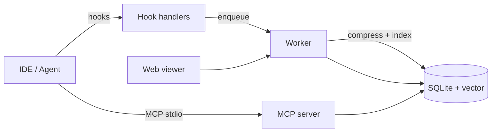

# cavemem

[](https://www.npmjs.com/package/cavemem)
[](https://github.com/JuliusBrussee/cavemem/actions)
[](./LICENSE)

> Persistent, cross-agent memory for coding assistants. Stored compressed. Retrieved fast. Local by default.

cavemem gives AI coding assistants a durable memory that survives sessions, spans IDEs, and does not bloat your prompt budget. Observations are compressed at the storage layer using a deterministic grammar tuned for code and devops prose. Retrieval uses hybrid keyword and vector search with progressive disclosure, so agents pull only what they need.

---

## Why

Agent memory systems typically store verbose text and pay for it on every retrieval. Long-running projects accumulate megabytes of observations, and each prompt drags in far more tokens than the model actually needs.

cavemem attacks this at the source. Every observation is compressed before it touches disk. Technical content — code, paths, URLs, commands, version numbers — is preserved exactly. Only the prose around it is compacted. On the in-repo benchmark corpus at default intensity, stored prose is ~33% smaller in tokens without losing a character of technical substance. Aggressive modes push further.

## Features

- **Persistent memory across sessions.** Hooks capture what happened; the store keeps it.
- **Compressed at rest.** Deterministic compression via the caveman grammar, with round-trip-guaranteed expansion for humans.
- **Progressive MCP retrieval.** Three tools — `search`, `timeline`, `get_observations` — let agents filter before fetching.
- **Hybrid search.** SQLite FTS5 for keyword + local vector index for semantics, combined with a tunable ranker.
- **Local by default.** No network calls required. Optional remote embedding providers behind a config flag.
- **Web viewer.** A read-only UI at `http://localhost:37777` for browsing sessions, observations, and summaries in human-readable form.
- **Cross-IDE installers.** Claude Code, Gemini CLI, OpenCode, Codex, Cursor — one command each.
- **Privacy-aware.** `<private>…</private>` tags strip content at the write boundary. Path globs can exclude whole directories.

## Install

```bash
# Claude Code (default)
npx cavemem install

# Other agents
npx cavemem install --ide gemini-cli
npx cavemem install --ide opencode
npx cavemem install --ide codex
npx cavemem install --ide cursor
```

The installer registers lifecycle hooks, adds the MCP server, writes a default `~/.cavemem/settings.json`, and starts the local worker.

## Quick start

```bash
npx cavemem install
npx cavemem doctor        # check setup
# ... use your IDE for a coding session ...
npx cavemem search "auth middleware"
open http://localhost:37777   # browse the viewer
```

## How it works



Compression in one line:

```
Input:  "The authentication middleware throws a 401 when the session token expires; we should add a refresh path."
Stored: "auth mw throws 401 @ session token expires. add refresh path."
Viewed: "The auth middleware throws 401 when the session token expires. Add refresh path."
```

Code blocks, URLs, paths, commands, dates, and version numbers are never touched.

## Configuration

`~/.cavemem/settings.json`:

| Key | Default | Description |
|---|---|---|
| `dataDir` | `~/.cavemem` | Database and log location |
| `workerPort` | `37777` | Local HTTP daemon port |
| `compression.intensity` | `full` | `lite` \| `full` \| `ultra` |
| `compression.expandForModel` | `false` | Return expanded text to the model instead of compressed |
| `embedding.provider` | `local` | `local` \| `ollama` \| `openai` |
| `embedding.model` | `Xenova/all-MiniLM-L6-v2` | Model identifier |
| `search.alpha` | `0.5` | Hybrid ranker weight; 0 = vector only, 1 = keyword only |
| `privacy.excludePatterns` | `[]` | Glob patterns never captured |
| `logLevel` | `info` | `debug` \| `info` \| `warn` \| `error` |
| `ides` | `{}` | Per-IDE enable/disable flags |

## CLI reference

```
cavemem install [--ide <name>]     Register hooks + MCP server
cavemem uninstall [--ide <name>]   Remove integration
cavemem doctor                     Run health checks
cavemem worker start|stop|status   Manage the local daemon
cavemem mcp                        Run MCP stdio server (usually invoked by the IDE)
cavemem search <query> [--limit N] Query memory from the terminal
cavemem compress <file>            Compress a file in place (.original backup)
cavemem expand <file>              Expand a compressed file
cavemem export <out.jsonl>         Export memory to JSONL
cavemem import <in.jsonl>          Import memory from JSONL
cavemem reindex                    Rebuild FTS and vector indexes
```

## MCP tools

| Tool | Input | Output |
|---|---|---|
| `search` | `{ query, limit? }` | `{ id, score, snippet, session_id, ts }[]` |
| `timeline` | `{ session_id, around_id?, limit? }` | `{ id, kind, ts }[]` |
| `get_observations` | `{ ids[], expand? }` | `{ id, content, metadata }[]` |

## Compression spec

See [`docs/compression.md`](./docs/compression.md) for the full grammar, intensity levels, and the round-trip guarantee. Benchmarks live in [`evals/`](./evals/).

## Privacy

- Anything wrapped in `<private>…</private>` is stripped before storage.
- Paths matching `privacy.excludePatterns` are never read.
- No telemetry. No network calls unless a remote embedding provider is configured.
- The worker binds to `127.0.0.1` only.

## Architecture

Monorepo layout (see [`CLAUDE.md`](./CLAUDE.md) for invariants):

```
apps/cli apps/worker apps/mcp-server
packages/config packages/compress packages/storage packages/core packages/hooks packages/installers
viewer/ hooks-scripts/ docs/ evals/
```

## Development

```bash
pnpm install
pnpm dev                    # CLI + worker in watch mode
pnpm test                   # vitest across all packages
pnpm typecheck
pnpm lint
pnpm build
```

Contributions are welcome. New IDEs, compression rules, and MCP tools all have documented extension points. See [`CLAUDE.md`](./CLAUDE.md) for extension points and performance budgets.

## Roadmap

- Encrypted-at-rest storage option.
- Team sync mode (optional, opt-in, end-to-end encrypted).
- Additional IDE installers as their hook APIs stabilize.
- Graph view in the viewer.

## License

MIT. See [LICENSE](./LICENSE).
